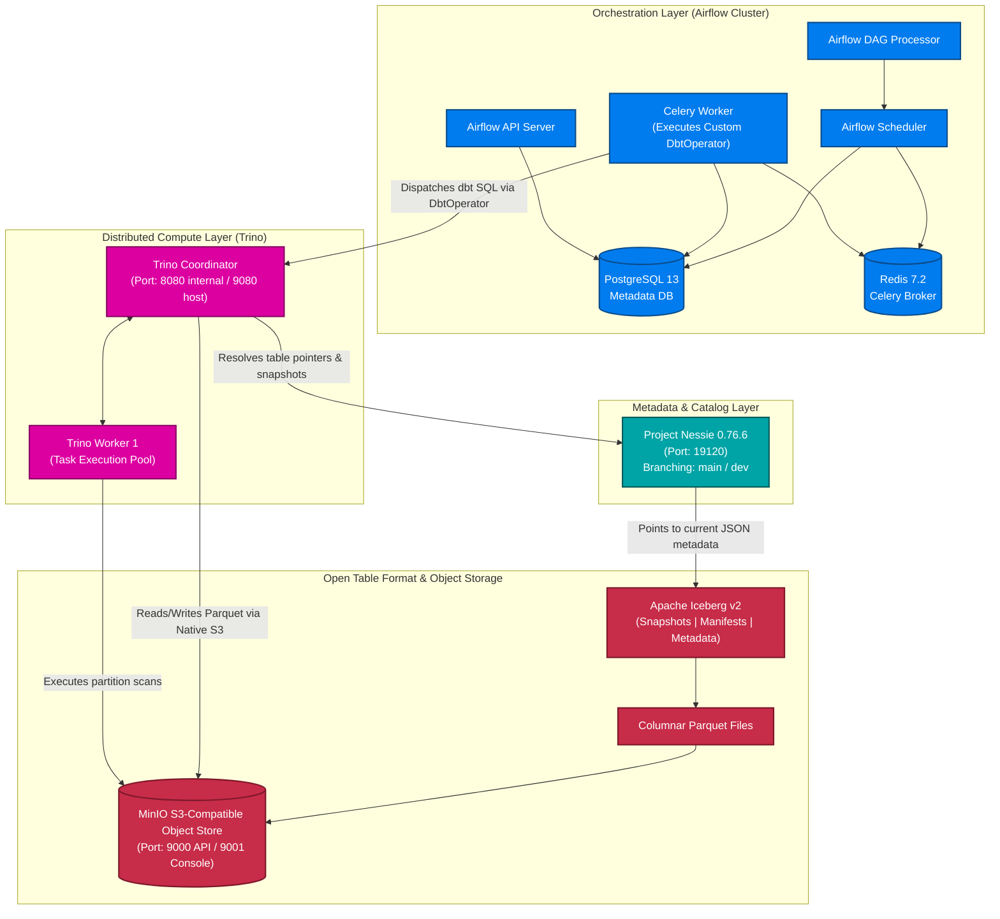
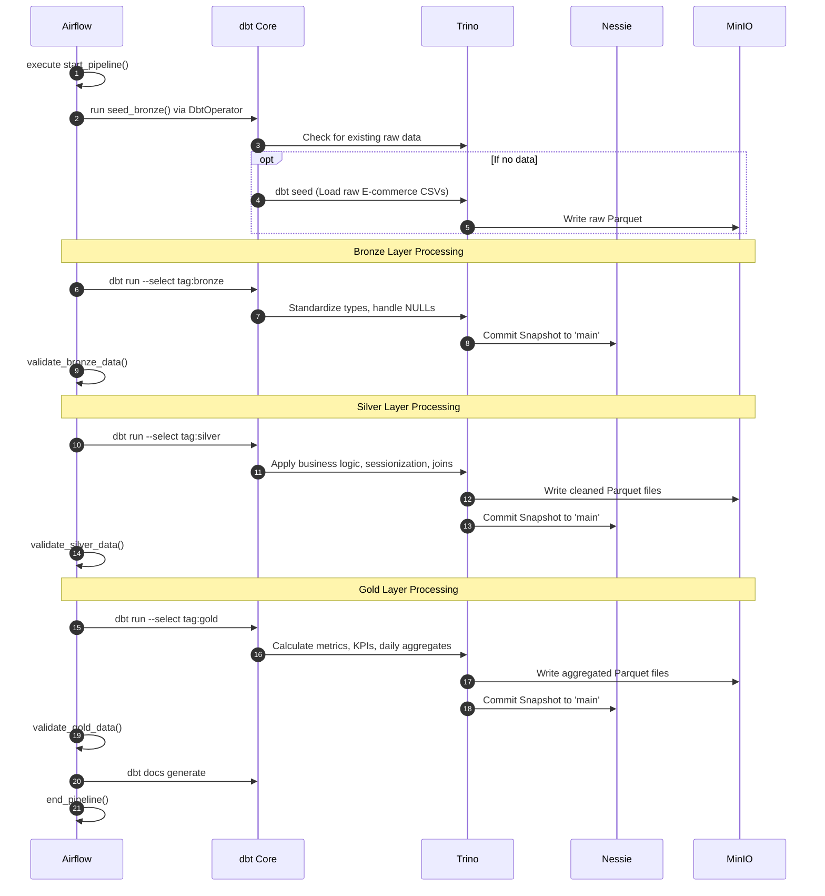

أكيد، هقسم لك الـ README على أجزاء (رسايل) منفصلة عشان يكون أسهل في النسخ والتعديل، وميقطعش أو يلخبط في التنسيق. كمان ظبطت الروابط بتاعة الصور عشان تشتغل معاك مظبوط، ورتبت الجزء بتاع الـ Project Structure.

ده **الجزء الأول** (بيحتوي على المقدمة، الفهرس، والـ Architecture):

---

# 🏛️ Distributed Data Lakehouse

### Enterprise-Grade Lakehouse Architecture Powered by Trino, Apache Iceberg, Project Nessie, dbt Core & Apache Airflow

---

## 📖 Table of Contents

* [Executive Summary](https://www.google.com/search?q=%23-executive-summary)
* [Architecture & Core Concepts](https://www.google.com/search?q=%23%EF%B8%8F-distributed-data-lakehouse-architecture)
* [End-to-End Data Workflow](https://www.google.com/search?q=%23-end-to-end-data-workflow)
* [The Medallion Data Model](https://www.google.com/search?q=%23-the-medallion-data-model)
* [Dockerized Infrastructure & Networking](https://www.google.com/search?q=%23-dockerized-infrastructure--networking)
* [Service Endpoints](https://www.google.com/search?q=%23-service-endpoints)
* [Deep Component Breakdown](https://www.google.com/search?q=%23-deep-component-breakdown)
* [Project Structure](https://www.google.com/search?q=%23-project-structure)
* [Configuration](https://www.google.com/search?q=%23-configuration)
* [Quick Start & Deployment Guide](https://www.google.com/search?q=%23-quick-start)
* [Validation & Smoke Tests](https://www.google.com/search?q=%23-validation--smoke-tests)
* [Engineering Highlights](https://www.google.com/search?q=%23-engineering-highlights)
* [Troubleshooting](https://www.google.com/search?q=%23-troubleshooting)
* [Security](https://www.google.com/search?q=%23-security)
* [Roadmap](https://www.google.com/search?q=%23-roadmap)

---

## 📌 Executive Summary

The **Distributed Data Lakehouse** is an end-to-end analytical data platform designed to process high-volume E-commerce data efficiently. It completely decouples storage, metadata, compute, and orchestration, resolving the limitations of traditional Data Warehouses (inflexibility, high cost) and Data Lakes (data swamps, lack of ACID guarantees).

At its core, this project demonstrates a highly robust **ELT pipeline**:

* **Storage & Format**: Raw and processed data are stored in **MinIO** as highly optimized Parquet files managed by **Apache Iceberg** table formats.


* **Compute & Catalog**: **Trino** executes all distributed SQL queries against the data, resolving table states and branches (e.g., `main` vs `dev`) through the **Project Nessie** catalog.


* **Transformation & Orchestration**: **dbt Core** handles the Medallion transformation logic (Bronze $\rightarrow$ Silver $\rightarrow$ Gold), meticulously orchestrated by an **Apache Airflow** DAG using a custom-built Python `DbtOperator`.


---

## 🏗️ Distributed Data Lakehouse Architecture



---
## 🔄 End-to-End Data Workflow

The data pipeline runs on a scheduled cadence (e.g., every 15 minutes) processing high volumes of raw E-commerce events[cite: 2].



---

## 📊 The Medallion Data Model

The lakehouse adopts the Medallion Architecture to progressively improve data structure, ensuring analytics dashboards only read optimized, heavily-aggregated data[cite: 2]. 

| Layer | Objective & Transformations | Examples from E-commerce Data |
| :--- | :--- | :--- |
| **Bronze** 🥉 | Stores raw source data. Modifies timestamps, handles empty strings (`''` to `NULL`), and adds audit metadata (`ingested_at`, `source_system`)[cite: 2]. | `bronze_customer_events`, `bronze_inventory_snapshots`, `bronze_payment_transactions`, `bronze_support_tickets`[cite: 2] |
| **Silver** 🥈 | Data cleaning, standardizing, and applying business logic. Handles sessionization (grouping user clicks), risk profiling for payments, and stock categorizations (Out of Stock, Low Stock)[cite: 2]. | `silver_customer_sessions`, `silver_inventory_status`, `silver_payment_profiles`, `silver_support_metrics`[cite: 2] |
| **Gold** 🥇 | Business-ready data. Pre-calculates heavy metrics, KPIs, aggregations, and daily rollups. Ready for BI tools (Power BI, Tableau) to consume directly without processing lag[cite: 2]. | `gold_daily_metrics`, `gold_customer_summary`, `gold_product_summary`[cite: 2] |

---

## 🐳 Dockerized Infrastructure & Networking

The environment is strictly containerized via Docker Compose. Understanding the networking routing is critical:

*   **Host Networking:** For accessing UIs from your local browser (e.g., `localhost:9080` routes to Trino).
*   **Container Networking:** For services communicating internally (e.g., Airflow accessing Trino via `trino-coordinator:8080`)[cite: 2].

| Service | Role | Host Port | Container Port | Exposure | Notes |
| :--- | :--- | :---: | :---: | :--- | :--- |
| `postgres` | Airflow Metadata DB | - | `5432` | Internal | Stores Airflow DAG states and configurations[cite: 2]. |
| `redis` | Celery Broker | - | `6379` | Internal | Message broker for Airflow CeleryExecutor[cite: 2]. |
| `minio` | S3 Object Storage | `9000`, `9001` | `9000`, `9001` | **External** | API (9000), Console Browser (9001)[cite: 2]. |
| `nessie-catalog` | Iceberg Catalog | `19120` | `19120` | **External** | Branching/Versioning[cite: 2]. |
| `trino-coordinator`| Query Coordinator | `9080` | `8080` | **External** | Host port mapped to 9080 to avoid Airflow's 8080 conflict[cite: 2]. |
| `trino-worker-1` | Query Worker | - | `8080` | Internal | Executes Trino tasks[cite: 2]. |
| `airflow-apiserver`| Airflow UI/API | `8080` | `8080` | **External** | Airflow 3.0.6[cite: 2]. |
| `airflow-worker` | Task Executor | - | - | Internal | Runs the custom Python DbtOperator[cite: 2]. |
| *(Airflow Core)* | Scheduler, Triggerer | - | - | Internal | Orchestration background daemon services[cite: 2]. |

---

## 🔌 Service Endpoints

| Service | Host URL | Container URL | Purpose |
| :--- | :--- | :--- | :--- |
| **Airflow UI** | `http://localhost:8080` | `http://airflow-apiserver:8080` | Monitor DAG runs, task logs, and schedules[cite: 2]. |
| **Trino UI** | `http://localhost:9080` | `http://trino-coordinator:8080` | View query execution plans and worker stats[cite: 2]. |
| **MinIO API** | `http://localhost:9000` | `http://minio:9000` | S3 API Endpoint for Iceberg table file writes[cite: 2]. |
| **MinIO Console** | `http://localhost:9001` | `http://minio:9001` | Object browser UI to inspect Parquet data files[cite: 2]. |
| **Nessie Catalog**| `http://localhost:19120` | `http://nessie-catalog:19120` | Catalog REST API for querying metadata branches[cite: 2]. |

---

## 🔍 Deep Component Breakdown

### 🌬️ Apache Airflow & Custom `DbtOperator`
Airflow acts strictly as an orchestrator ("When and how to execute") rather than performing data transformations itself[cite: 2]. To bridge Airflow and dbt elegantly, a custom **`DbtOperator`** was developed in Python extending Airflow's `BaseOperator`[cite: 2]. This class uses the `dbtRunner` API to execute dbt commands directly inside the Airflow worker memory, rather than relying on clumsy Bash subshells[cite: 2].

### 🛠️ dbt Core (Data Build Tool)
dbt handles all data transformations ("How the data is modified")[cite: 2]. 
*   **Tags & Execution**: The Airflow DAG triggers dbt models sequentially using tags (`dbt run --select tag:bronze`, then `tag:silver`, then `tag:gold`)[cite: 2].
*   **Testing**: Data quality assertions (`unique`, `not_null`) are defined in `schema.yml` and run against the Iceberg tables via `dbt test` to ensure referential integrity[cite: 2].

### ⚡ Trino (Query Engine)
Trino is the distributed SQL engine executing the actual queries ("Who executes the SQL")[cite: 2]. It is connected to the Iceberg catalog via its `iceberg.properties` configuration[cite: 2]. Trino evaluates predicates, performs data skipping, and reads/writes the Parquet files stored in MinIO[cite: 2].

### 🧊 Project Nessie & Apache Iceberg
*   **Iceberg**: Manages the open table format metadata (Snapshots $\rightarrow$ Manifest Lists $\rightarrow$ Manifest Files $\rightarrow$ Parquet) allowing for data skipping, concurrent writes, and time travel[cite: 2].
*   **Nessie**: Acts as "Git for Data". It allows Trino to point to different branches of the catalog (e.g., `main` vs `dev`). You can isolate development transformations in the `dev` branch without affecting production `main` data[cite: 2].

---
---

## 📁 Project Structure

```text
.
├── dags/
│   ├── ecommerce_dag.py          # Primary medallion Airflow DAG
│   ├── dbt_operator.py           # Custom Python BaseOperator for dbt
│   └── ecommerce_dbt/            # Complete dbt Core project
│       ├── dbt_project.yml       # dbt configurations, tags, and materializations[cite: 2]
│       ├── profiles.yml          # Trino coordinator connection settings[cite: 2]
│       ├── models/
│       │   ├── bronze/           # Source schema transformations (CSV -> Iceberg)[cite: 2]
│       │   │   ├── bronze_customer_events.sql
│       │   │   └── schema.yml    # Data quality tests (unique, not_null)[cite: 2]
│       │   ├── silver/           # Enriched business entities & sessionization[cite: 2]
│       │   └── gold/             # Aggregated KPI data marts & BI models[cite: 2]
│       └── seeds/                # Raw E-commerce seed CSVs[cite: 2]
├── config/                       # Airflow & service configuration mounts
├── trino/
│   └── catalog/
│       └── iceberg.properties    # Trino Iceberg-Nessie-MinIO catalog connector[cite: 2]
├── Dockerfile                    # Custom Airflow image with dbt-trino & dependencies
├── docker-compose.yaml           # Full infrastructure orchestration
├── pyproject.toml                # Project dependency manifest
├── requirements.txt              # Pinned Python package dependencies (Airflow 3.0.6, etc.)
└── README.md

```

## ⚙️ Configuration

### Trino Catalog Configuration (`trino/catalog/iceberg.properties`)

This file is the most critical integration point, linking the query engine to the catalog and storage layer:

```properties
connector.name=iceberg
iceberg.catalog.type=nessie
iceberg.nessie-catalog.uri=http://nessie-catalog:19120/api/v1
iceberg.nessie-catalog.ref=main
iceberg.nessie-catalog.default-warehouse-dir=s3://lakehouse
fs.native-s3.enabled=true
s3.endpoint=http://minio:9000
s3.region=us-east-1
s3.path-style-access=true

```

### dbt Project Profile (`profiles.yml`)

Configures dbt to connect directly to the Trino Coordinator over the Docker network:

```yaml
ecommerce_dbt:
  target: dev
  outputs:
    dev:
      type: trino
      method: none
      user: admin
      database: iceberg
      schema: bronze
      threads: 3
      host: trino-coordinator
      port: 8080

```

## 🚀 Quick Start

### 1. Clone & Bootstrap Stack

Use modern Docker Compose syntax to clone and build the custom images:

```bash
git clone https://github.com/omaga333/Distributed-Data-Lakehouse.git
cd Distributed-Data-Lakehouse

# Build custom images and start the entire cluster in detached mode
docker compose up -d --build

# Verify container statuses and health
docker compose ps

```

### 2. Verify Services

Check the startup sequences of the core control plane services to ensure they are communicating properly:

```bash
# Check Nessie Catalog startup
docker compose logs nessie-catalog --tail 100

# Check Trino Coordinator
docker compose logs trino-coordinator --tail 100

# Check Airflow Worker readiness
docker compose logs airflow-worker --tail 100

```

### 3. Graceful Shutdown & Cleanup

```bash
# Stop containers without losing data
docker compose down

# Stop containers and wipe volumes for a clean slate
docker compose down -v

```

## ✅ Validation & Smoke Tests

### Validating Trino, Nessie & MinIO Integration

You can use any SQL Client (like DBeaver) connecting to `localhost:9080` or use the Trino CLI natively via Docker:

```bash
docker compose exec trino-coordinator trino

```

Run these commands to validate catalog connections:

```sql
-- 1. Ensure the iceberg catalog is visible
SHOW CATALOGS;

-- 2. Verify namespaces
SHOW SCHEMAS FROM iceberg;

-- 3. Create a test schema and table
CREATE SCHEMA IF NOT EXISTS iceberg.lakehouse;

CREATE TABLE iceberg.lakehouse.test_table (
    id INTEGER,
    name VARCHAR
);

-- 4. Insert data and query it
INSERT INTO iceberg.lakehouse.test_table VALUES (1, 'Ahmed'), (2, 'Mohamed');

SELECT * FROM iceberg.lakehouse.test_table;

```

*(Note: Creating a MinIO bucket does not automatically create Iceberg namespaces; you must explicitly run `CREATE SCHEMA` first.)*

### Running the Pipeline

1. Navigate to the Airflow UI at `http://localhost:8080`.
2. Login with standard configured credentials.
3. Unpause `ecommerce_dag_pipeline`.
4. Trigger the DAG manually and monitor the execution logs as the Custom `DbtOperator` passes the context to `dbtRunner`.

## 🧠 Engineering Highlights

* **Git-for-Data Isolation:** By integrating Project Nessie, data engineers can test new models on a `dev` branch. Setting `iceberg.nessie-catalog.ref=dev` routes Trino to a completely isolated state of the lakehouse, avoiding corruption of `main` production data.


* **Intelligent Resource Scaling:** During testing, the pipeline encountered `Maximum retry exceeded` errors due to RAM starvation when running too many Trino workers concurrently with Airflow and dbt. By deliberately downscaling to **1 Trino worker** and limiting threads, local performance stabilized, proving that horizontal scaling must respect underlying hardware constraints.


* **Custom Pythonic `DbtOperator`:** Instead of running messy `BashOperator` scripts, a custom operator was built using `dbtRunner`. It automatically handles checking for project directories, generating dynamic log directories, parsing command arguments, and natively failing the Airflow task if the Python invocation fails.


* **Complete Lakehouse Decoupling:** Airflow orchestrates, dbt transforms, Trino queries, Iceberg abstracts the tables, and MinIO stores the files. Every layer is independently scalable and replaceable.


## 🛠️ Troubleshooting

* **System Freeze / "Maximum retry exceeded" Error in Airflow:**
* **Cause:** Host system is running out of RAM (OOM) due to multiple Trino workers and high dbt thread counts competing for resources.


* **Fix:** Scale down Trino to 1 Worker in `docker-compose.yaml` and reduce the dbt thread count in `profiles.yml` to 1 or 2. Restart with `docker compose down -v` and `docker compose up -d`.


* **Trino cannot connect to MinIO:**
* **Symptom:** `S3Exception: Access Denied` or connection refused in Trino logs.
* **Fix:** Ensure `s3.endpoint=http://minio:9000` is set and `s3.path-style-access=true` is enabled in `iceberg.properties`. Do not use `localhost` inside container-to-container configurations.


* **Nessie Manifest Error / Tag Doesn't Exist:**
* **Symptom:** `manifest for project Nessie... is not found` during docker image pull.


* **Fix:** Ensure the exact image tag exists on Docker Hub (e.g., `0.76.6` instead of a non-existent version).


* **Port Conflicts:**
* **Symptom:** Docker fails to bind `0.0.0.0:8080`.
* **Fix:** Ensure you are accessing Trino via `localhost:9080`. Trino's host port was mapped to 9080 to prevent conflicts with Airflow's 8080 UI port.


## 🔐 Security

* **Environment Variables:** Ensure any `.env` file containing MinIO root user/password and Postgres credentials is added to `.gitignore` and never committed to version control.


* **Development Credentials:** The current configuration (e.g., MinIO user `minioadmin`) is for **local development and portfolio demonstration purposes only**.


* **Production:** In a production deployment, inject credentials at runtime using secrets management tools (e.g., HashiCorp Vault, AWS Secrets Manager) instead of hardcoding them into Docker Compose files.

## 🗺️ Roadmap

**Current Status:** Active Development / Learning / Portfolio Project

### Planned Future Improvements

* [ ] **Apache Spark**: Integrate Spark for heavy ML feature processing.
* [ ] **Streaming Ingestion**: Introduce Apache Kafka / Redpanda for real-time E-commerce events.
* [ ] **Data Quality Checkpoints**: Implement Soda Core or Great Expectations for robust pipeline assertions before publishing to the Gold layer.
* [ ] **Cloud Migration**: Provide Terraform configuration to deploy the stack to AWS (EKS, S3, RDS).
* [ ] **CI/CD pipeline**: Add GitHub Actions for linting SQL (`sqlfluff`) and automated testing of dbt models.

---

**Author**: [omaga333](https://www.google.com/search?q=https://github.com/omaga333) | **Repository**: [Distributed-Data-Lakehouse](https://github.com/omaga333/Distributed-Data-Lakehouse)
