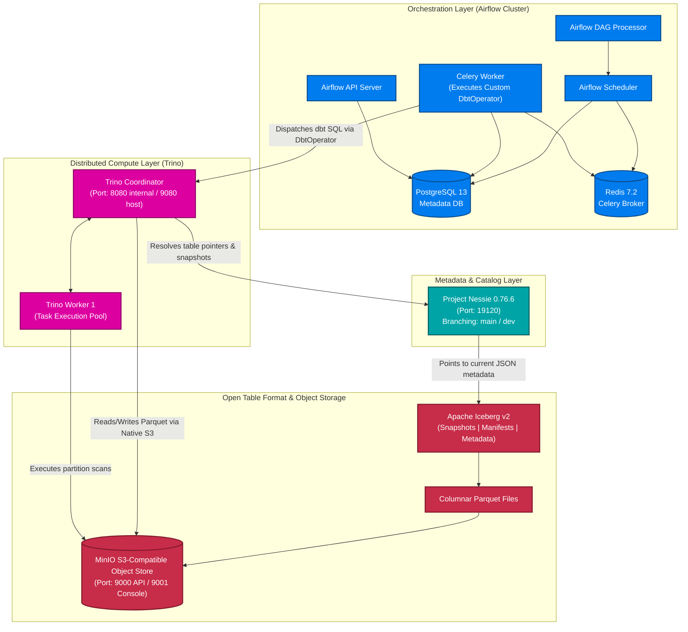

أكيد، هقسم لك الـ README على أجزاء (رسايل) منفصلة عشان يكون أسهل في النسخ والتعديل، وميقطعش أو يلخبط في التنسيق. كمان ظبطت الروابط بتاعة الصور عشان تشتغل معاك مظبوط، ورتبت الجزء بتاع الـ Project Structure.

ده **الجزء الأول** (بيحتوي على المقدمة، الفهرس، والـ Architecture):

---

# 🏛️ Distributed Data Lakehouse

### Enterprise-Grade Lakehouse Architecture Powered by Trino, Apache Iceberg, Project Nessie, dbt Core & Apache Airflow

---

## 📖 Table of Contents

* [Executive Summary](https://www.google.com/search?q=%23-executive-summary)
* [Architecture & Core Concepts](https://www.google.com/search?q=%23%EF%B8%8F-distributed-data-lakehouse-architecture)
* [End-to-End Data Workflow](https://www.google.com/search?q=%23-end-to-end-data-workflow)
* [The Medallion Data Model](https://www.google.com/search?q=%23-the-medallion-data-model)
* [Dockerized Infrastructure & Networking](https://www.google.com/search?q=%23-dockerized-infrastructure--networking)
* [Service Endpoints](https://www.google.com/search?q=%23-service-endpoints)
* [Deep Component Breakdown](https://www.google.com/search?q=%23-deep-component-breakdown)
* [Project Structure](https://www.google.com/search?q=%23-project-structure)
* [Configuration](https://www.google.com/search?q=%23-configuration)
* [Quick Start & Deployment Guide](https://www.google.com/search?q=%23-quick-start)
* [Validation & Smoke Tests](https://www.google.com/search?q=%23-validation--smoke-tests)
* [Engineering Highlights](https://www.google.com/search?q=%23-engineering-highlights)
* [Troubleshooting](https://www.google.com/search?q=%23-troubleshooting)
* [Security](https://www.google.com/search?q=%23-security)
* [Roadmap](https://www.google.com/search?q=%23-roadmap)

---

## 📌 Executive Summary

The **Distributed Data Lakehouse** is an end-to-end analytical data platform designed to process high-volume E-commerce data efficiently. It completely decouples storage, metadata, compute, and orchestration, resolving the limitations of traditional Data Warehouses (inflexibility, high cost) and Data Lakes (data swamps, lack of ACID guarantees).

At its core, this project demonstrates a highly robust **ELT pipeline**:

* **Storage & Format**: Raw and processed data are stored in **MinIO** as highly optimized Parquet files managed by **Apache Iceberg** table formats.

* **Compute & Catalog**: **Trino** executes all distributed SQL queries against the data, resolving table states and branches (e.g., `main` vs `dev`) through the **Project Nessie** catalog.

* **Transformation & Orchestration**: **dbt Core** handles the Medallion transformation logic (Bronze $\rightarrow$ Silver $\rightarrow$ Gold), meticulously orchestrated by an **Apache Airflow** DAG using a custom-built Python `DbtOperator`.

---

## 🏗️ Distributed Data Lakehouse Architecture

---

أكيد، هقسم لك الـ README على أجزاء (رسايل) منفصلة عشان يكون أسهل في النسخ والتعديل، وميقطعش أو يلخبط في التنسيق. كمان ظبطت الروابط بتاعة الصور عشان تشتغل معاك مظبوط، ورتبت الجزء بتاع الـ Project Structure.

ده **الجزء الأول** (بيحتوي على المقدمة، الفهرس، والـ Architecture):

---

# 🏛️ Distributed Data Lakehouse

### Enterprise-Grade Lakehouse Architecture Powered by Trino, Apache Iceberg, Project Nessie, dbt Core & Apache Airflow

---

## 📖 Table of Contents

* [Executive Summary](https://www.google.com/search?q=%23-executive-summary)
* [Architecture & Core Concepts](https://www.google.com/search?q=%23%EF%B8%8F-distributed-data-lakehouse-architecture)
* [End-to-End Data Workflow](https://www.google.com/search?q=%23-end-to-end-data-workflow)
* [The Medallion Data Model](https://www.google.com/search?q=%23-the-medallion-data-model)
* [Dockerized Infrastructure & Networking](https://www.google.com/search?q=%23-dockerized-infrastructure--networking)
* [Service Endpoints](https://www.google.com/search?q=%23-service-endpoints)
* [Deep Component Breakdown](https://www.google.com/search?q=%23-deep-component-breakdown)
* [Project Structure](https://www.google.com/search?q=%23-project-structure)
* [Configuration](https://www.google.com/search?q=%23-configuration)
* [Quick Start & Deployment Guide](https://www.google.com/search?q=%23-quick-start)
* [Validation & Smoke Tests](https://www.google.com/search?q=%23-validation--smoke-tests)
* [Engineering Highlights](https://www.google.com/search?q=%23-engineering-highlights)
* [Troubleshooting](https://www.google.com/search?q=%23-troubleshooting)
* [Security](https://www.google.com/search?q=%23-security)
* [Roadmap](https://www.google.com/search?q=%23-roadmap)

---

## 📌 Executive Summary

The **Distributed Data Lakehouse** is an end-to-end analytical data platform designed to process high-volume E-commerce data efficiently. It completely decouples storage, metadata, compute, and orchestration, resolving the limitations of traditional Data Warehouses (inflexibility, high cost) and Data Lakes (data swamps, lack of ACID guarantees).

At its core, this project demonstrates a highly robust **ELT pipeline**:

* **Storage & Format**: Raw and processed data are stored in **MinIO** as highly optimized Parquet files managed by **Apache Iceberg** table formats.

* **Compute & Catalog**: **Trino** executes all distributed SQL queries against the data, resolving table states and branches (e.g., `main` vs `dev`) through the **Project Nessie** catalog.

* **Transformation & Orchestration**: **dbt Core** handles the Medallion transformation logic (Bronze $\rightarrow$ Silver $\rightarrow$ Gold), meticulously orchestrated by an **Apache Airflow** DAG using a custom-built Python `DbtOperator`.

---

## 🏗️ Distributed Data Lakehouse Architecture

---

