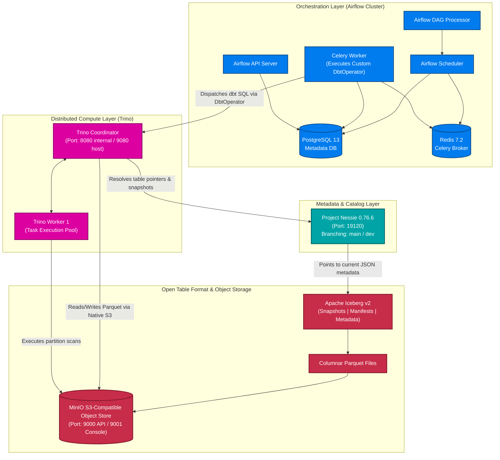
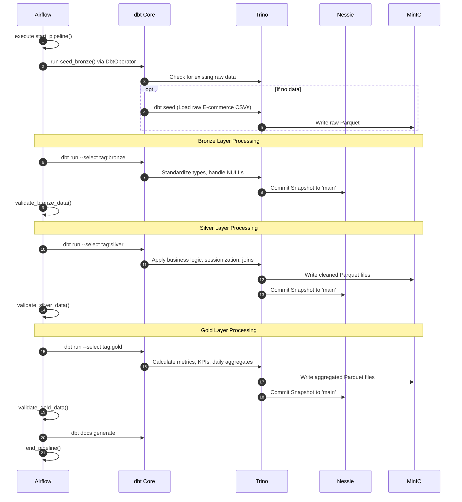

# 🏛️ Distributed Data Lakehouse

### Enterprise-Grade Lakehouse Architecture Powered by Trino, Apache Iceberg, Project Nessie, dbt Core & Apache Airflow

  A modern, decoupled, Git-for-Data lakehouse implementing the Medallion Architecture (Bronze, Silver, Gold) with distributed query execution, ACID transactions, and automated orchestration[cite: 2].


  
    https://cdn.jsdelivr.net/gh/devicons/devicon/icons/apache/apache-original.svg" width="55" height="55" alt="Airflow"/>Airflow
    https://trino.io/assets/images/trino-logo.png" width="55" height="55" alt="Trino"/>Trino
    https://iceberg.apache.org/assets/images/iceberg-logo-icon.png" width="55" height="55" alt="Iceberg"/>Iceberg
    https://projectnessie.org/img/nessie-logo.svg" width="55" height="55" alt="Nessie"/>Nessie
    https://cdn.jsdelivr.net/gh/devicons/devicon/icons/dbt/dbt-original.svg" width="55" height="55" alt="dbt"/>dbt Core
    https://min.io/resources/img/logo/MINIO_Bird.png" width="55" height="55" alt="MinIO"/>MinIO
    https://cdn.jsdelivr.net/gh/devicons/devicon/icons/postgresql/postgresql-original.svg" width="55" height="55" alt="PostgreSQL"/>Postgres
    https://cdn.jsdelivr.net/gh/devicons/devicon/icons/redis/redis-original.svg" width="55" height="55" alt="Redis"/>Redis
    https://cdn.jsdelivr.net/gh/devicons/devicon/icons/docker/docker-original.svg" width="55" height="55" alt="Docker"/>Docker
    https://cdn.jsdelivr.net/gh/devicons/devicon/icons/python/python-original.svg" width="55" height="55" alt="Python"/>Python
  


https://raw.githubusercontent.com/andreasbm/readme/master/assets/lines/aqua.png" width="100%" />

## 📖 Table of Contents

- [Executive Summary](#-executive-summary)
- [Architecture & Core Concepts](#️-distributed-data-lakehouse-architecture)
- [End-to-End Data Workflow](#-end-to-end-data-workflow)
- [The Medallion Data Model](#-the-medallion-data-model)
- [Dockerized Infrastructure & Networking](#-dockerized-infrastructure--networking)
- [Service Endpoints](#-service-endpoints)
- [Deep Component Breakdown](#-deep-component-breakdown)
- [Project Structure](#-project-structure)
- [Quick Start & Deployment Guide](#-quick-start)
- [Validation & Smoke Tests](#-validation--smoke-tests)
- [Engineering Highlights](#-engineering-highlights)
- [Troubleshooting](#-troubleshooting)
- [Security](#-security)
- [Roadmap](#-roadmap)

https://raw.githubusercontent.com/andreasbm/readme/master/assets/lines/aqua.png" width="100%" />

## 📌 Executive Summary

The **Distributed Data Lakehouse** is an end-to-end analytical data platform designed to process high-volume E-commerce data[cite: 2]. It completely decouples storage, metadata, compute, and orchestration, resolving the limitations of traditional Data Warehouses (inflexibility, high cost) and Data Lakes (data swamps, lack of ACID guarantees)[cite: 2]. 

At its core, this project demonstrates a highly robust **ELT pipeline**:
*   **Storage & Format**: Raw and processed data are stored in **MinIO** as highly optimized Parquet files managed by **Apache Iceberg** table formats[cite: 2].
*   **Compute & Catalog**: **Trino** executes all distributed SQL queries against the data, resolving table states and branches (e.g., `main` vs `dev`) through the **Project Nessie** catalog[cite: 2]. 
*   **Transformation & Orchestration**: **dbt Core** handles the Medallion transformation logic (Bronze $\rightarrow$ Silver $\rightarrow$ Gold), meticulously orchestrated by an **Apache Airflow** DAG using a custom-built `DbtOperator`[cite: 2].

https://raw.githubusercontent.com/andreasbm/readme/master/assets/lines/aqua.png" width="100%" />

## 🏗️ Distributed Data Lakehouse Architecture



https://raw.githubusercontent.com/andreasbm/readme/master/assets/lines/aqua.png" width="100%" />

## 🔄 End-to-End Data Workflow

The data pipeline runs on a scheduled cadence (every 15 minutes) processing thousands of E-commerce events[cite: 2].



https://raw.githubusercontent.com/andreasbm/readme/master/assets/lines/aqua.png" width="100%" />

## 📊 The Medallion Data Model

The lakehouse adopts the Medallion Architecture to progressively improve data structure, ensuring analytics dashboards only read optimized, heavily-aggregated data[cite: 2]. 

| Layer | Objective & Transformations[cite: 2] | Examples from E-commerce Data[cite: 2] |
| :--- | :--- | :--- |
| **Bronze** 🥉 | Stores raw source data. Modifies timestamps, handles empty strings (`''` to `NULL`), and adds metadata (`ingested_at`, `source_system`). | `bronze_customer_events`, `bronze_inventory_snapshots`, `bronze_payment_transactions`, `bronze_support_tickets` |
| **Silver** 🥈 | Data cleaning, standardizing, and applying business logic. Handles sessionization (grouping user clicks), risk profiling for payments, and stock categorizations (Out of Stock, Low Stock). | `silver_customer_sessions`, `silver_inventory_status`, `silver_payment_profiles`, `silver_support_metrics` |
| **Gold** 🥇 | Business-ready data. Pre-calculates heavy metrics, KPIs, aggregations, and daily rollups. Ready for BI tools (Power BI, Tableau) to consume directly without processing lag. | `gold_daily_metrics`, `gold_customer_summary`, `gold_product_summary` |

https://raw.githubusercontent.com/andreasbm/readme/master/assets/lines/aqua.png" width="100%" />

## 🐳 Dockerized Infrastructure & Networking

The environment is containerized via Docker Compose. Understanding the networking rules is critical:
*   **Host Networking:** For accessing UIs from your local browser (e.g., `localhost:9080` for Trino).
*   **Container Networking:** For services communicating internally (e.g., Airflow accessing Trino via `trino-coordinator:8080`)[cite: 2].

| Service | Role | Host Port | Container Port | Exposure | Notes |
| :--- | :--- | :---: | :---: | :--- | :--- |
| `postgres` | Airflow Metadata DB | - | `5432` | Internal | Stores Airflow DAG states[cite: 2] |
| `redis` | Celery Broker | - | `6379` | Internal | Message broker for Celery[cite: 2] |
| `minio` | S3 Object Storage | `9000`, `9001` | `9000`, `9001` | **External** | API (9000), Console (9001)[cite: 2] |
| `nessie-catalog` | Iceberg Catalog | `19120` | `19120` | **External** | Branching/Versioning[cite: 2] |
| `trino-coordinator` | Query Coordinator | `9080` | `8080` | **External** | Host port mapped to 9080 to avoid Airflow 8080 conflict[cite: 2] |
| `trino-worker-1` | Query Worker | - | `8080` | Internal | Executes Trino tasks[cite: 2] |
| `airflow-apiserver` | Airflow UI/API | `8080` | `8080` | **External** | Airflow 3.0.6[cite: 2] |
| `airflow-worker` | Task Executor | - | - | Internal | Runs custom DbtOperator[cite: 2] |
| *(Other Airflow)* | Scheduler, DAG processor | - | - | Internal | Orchestration background services |


## 🔌 Service Endpoints

| Service | Host URL | Container URL | Purpose |
| :--- | :--- | :--- | :--- |
| **Airflow UI** | http://localhost:8080 | `http://airflow-apiserver:8080` | Monitor DAG runs and task logs. |
| **Trino UI** | http://localhost:9080 | `http://trino-coordinator:8080` | View query plans and worker stats. |
| **MinIO API** | http://localhost:9000 | `http://minio:9000` | S3 API Endpoint for Iceberg tables[cite: 2]. |
| **MinIO Console** | http://localhost:9001 | `http://minio:9001` | Object browser UI[cite: 2]. |
| **Nessie Catalog**| http://localhost:19120 | `http://nessie-catalog:19120` | Catalog REST API[cite: 2]. |

https://raw.githubusercontent.com/andreasbm/readme/master/assets/lines/aqua.png" width="100%" />

## 🔍 Deep Component Breakdown

### 🌬️ Apache Airflow & Custom `DbtOperator`
Airflow acts strictly as an orchestrator ("When and how to execute") rather than performing data transformations itself[cite: 2]. 
To bridge Airflow and dbt elegantly, a custom **`DbtOperator`** was developed in Python extending Airflow's `BaseOperator`[cite: 2]. This class uses the `dbtRunner` API to execute dbt commands directly without relying on clumsy subshells[cite: 2].

### 🛠️ dbt Core (Data Build Tool)
dbt handles all data transformations ("How the data is modified")[cite: 2]. 
*   **Tags & Execution**: The Airflow DAG triggers dbt models sequentially using tags (`dbt run --select tag:bronze`, then `tag:silver`, then `tag:gold`)[cite: 2].
*   **Testing**: Data quality assertions (`unique`, `not_null`) are defined in `schema.yml` and run against the Iceberg tables via `dbt test` to ensure referential integrity[cite: 2].

### ⚡ Trino (Query Engine)
Trino is the distributed SQL engine executing the actual queries ("Who executes the SQL")[cite: 2]. It is connected to the Iceberg catalog via its `iceberg.properties` configuration[cite: 2]:
```properties
connector.name=iceberg
iceberg.catalog.type=nessie
iceberg.nessie-catalog.uri=http://nessie-catalog:19120/api/v1
iceberg.nessie-catalog.ref=main
iceberg.nessie-catalog.default-warehouse-dir=s3://lakehouse
fs.native-s3.enabled=true
s3.endpoint=http://minio:9000
```

### 🧊 Project Nessie & Apache Iceberg
*   **Iceberg**: Manages the open table format metadata (Snapshots $\rightarrow$ Manifest Lists $\rightarrow$ Manifest Files $\rightarrow$ Parquet) allowing for data skipping and time travel[cite: 2].
*   **Nessie**: Acts as "Git for Data". It allows Trino to point to different branches of the catalog (e.g., `main` vs `dev`)[cite: 2]. You can isolate development transformations in the `dev` branch without affecting production `main` data[cite: 2].

https://raw.githubusercontent.com/andreasbm/readme/master/assets/lines/aqua.png" width="100%" />

## 📁 Project Structure

```text
.
├── dags/
│   ├── ecommerce_dag.py          # Primary medallion Airflow DAG
│   └── ecommerce_dbt/            # Complete dbt Core project
│       ├── dbt_project.yml       # dbt configurations, tags, and materializations
│       ├── profiles.yml          # Trino coordinator connection settings
│       ├── models/
│       │   ├── bronze/           # Source schema transformations (CSV -> Iceberg)
│       │   │   ├── bronze_customer_events.sql
│       │   │   ├── bronze_inventory_snapshots.sql
│       │   │   ├── bronze_payment_transactions.sql
│       │   │   ├── bronze_support_tickets.sql
│       │   │   └── schema.yml    # Data quality tests (unique, not_null)
│       │   ├── silver/           # Enriched business entities & sessionization
│       │   └── gold/             # Aggregated KPI data marts & BI models
│       └── seeds/                # Raw E-commerce seed CSVs
├── config/                       # Airflow & service configuration mounts
├── trino/
│   └── catalog/
│       └── iceberg.properties    # Trino Iceberg-Nessie-MinIO catalog connector
├── Dockerfile                    # Custom Airflow image with dbt-trino & dependencies
├── docker-compose.yaml           # Full infrastructure orchestration
├── pyproject.toml                # Project dependency manifest
├── requirements.txt              # Pinned Python package dependencies (Airflow 3.0.6, etc.)
└── README.m
