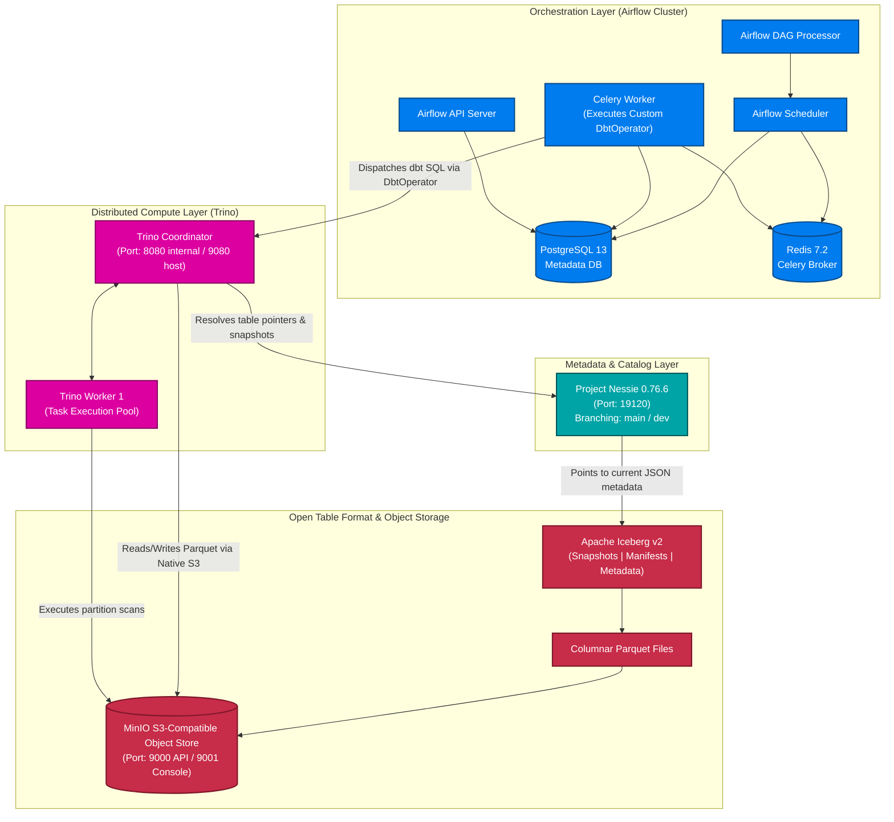
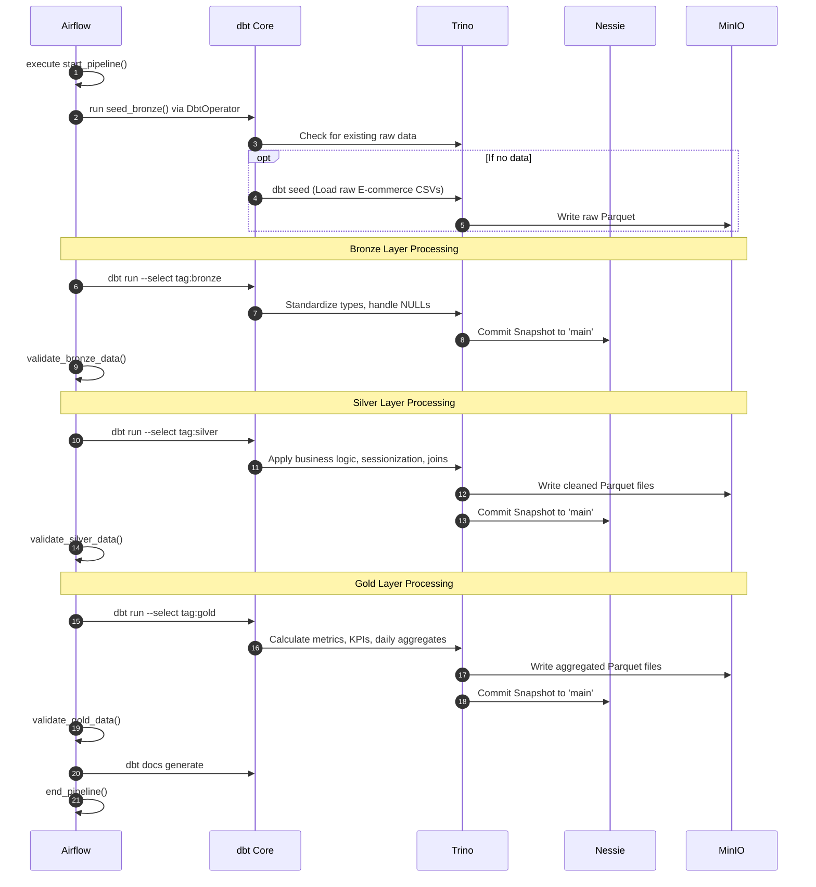

أكيد، هقسم لك الـ README على أجزاء (رسايل) منفصلة عشان يكون أسهل في النسخ والتعديل، وميقطعش أو يلخبط في التنسيق. كمان ظبطت الروابط بتاعة الصور عشان تشتغل معاك مظبوط، ورتبت الجزء بتاع الـ Project Structure.

ده **الجزء الأول** (بيحتوي على المقدمة، الفهرس، والـ Architecture):

---

# 🏛️ Distributed Data Lakehouse

### Enterprise-Grade Lakehouse Architecture Powered by Trino, Apache Iceberg, Project Nessie, dbt Core & Apache Airflow

---

## 📖 Table of Contents

* [Executive Summary](https://www.google.com/search?q=%23-executive-summary)
* [Architecture & Core Concepts](https://www.google.com/search?q=%23%EF%B8%8F-distributed-data-lakehouse-architecture)
* [End-to-End Data Workflow](https://www.google.com/search?q=%23-end-to-end-data-workflow)
* [The Medallion Data Model](https://www.google.com/search?q=%23-the-medallion-data-model)
* [Dockerized Infrastructure & Networking](https://www.google.com/search?q=%23-dockerized-infrastructure--networking)
* [Service Endpoints](https://www.google.com/search?q=%23-service-endpoints)
* [Deep Component Breakdown](https://www.google.com/search?q=%23-deep-component-breakdown)
* [Project Structure](https://www.google.com/search?q=%23-project-structure)
* [Configuration](https://www.google.com/search?q=%23-configuration)
* [Quick Start & Deployment Guide](https://www.google.com/search?q=%23-quick-start)
* [Validation & Smoke Tests](https://www.google.com/search?q=%23-validation--smoke-tests)
* [Engineering Highlights](https://www.google.com/search?q=%23-engineering-highlights)
* [Troubleshooting](https://www.google.com/search?q=%23-troubleshooting)
* [Security](https://www.google.com/search?q=%23-security)
* [Roadmap](https://www.google.com/search?q=%23-roadmap)

---

## 📌 Executive Summary

The **Distributed Data Lakehouse** is an end-to-end analytical data platform designed to process high-volume E-commerce data efficiently. It completely decouples storage, metadata, compute, and orchestration, resolving the limitations of traditional Data Warehouses (inflexibility, high cost) and Data Lakes (data swamps, lack of ACID guarantees).

At its core, this project demonstrates a highly robust **ELT pipeline**:

* **Storage & Format**: Raw and processed data are stored in **MinIO** as highly optimized Parquet files managed by **Apache Iceberg** table formats.

* **Compute & Catalog**: **Trino** executes all distributed SQL queries against the data, resolving table states and branches (e.g., `main` vs `dev`) through the **Project Nessie** catalog.

* **Transformation & Orchestration**: **dbt Core** handles the Medallion transformation logic (Bronze $\rightarrow$ Silver $\rightarrow$ Gold), meticulously orchestrated by an **Apache Airflow** DAG using a custom-built Python `DbtOperator`.

---

## 🏗️ Distributed Data Lakehouse Architecture

ده **الجزء التاني** (بيحتوي على الـ Workflow، تفاصيل الـ Medallion Model، الـ Docker Infrastructure، ونقاط الـ Endpoints والـ Components):

---

## 🔄 End-to-End Data Workflow

The data pipeline runs on a scheduled cadence (e.g., every 15 minutes) processing high volumes of raw E-commerce events.

---

## 📊 The Medallion Data Model

The lakehouse adopts the Medallion Architecture to progressively improve data structure, ensuring analytics dashboards only read optimized, heavily-aggregated data.

| Layer | Objective & Transformations | Examples from E-commerce Data |
| --- | --- | --- |
| **Bronze** 🥉 | Stores raw source data. Modifies timestamps, handles empty strings (`''` to `NULL`), and adds audit metadata (`ingested_at`, `source_system`).

 | `bronze_customer_events`, `bronze_inventory_snapshots`, `bronze_payment_transactions`, `bronze_support_tickets`  |
| **Silver** 🥈 | Data cleaning, standardizing, and applying business logic. Handles sessionization (grouping user clicks), risk profiling for payments, and stock categorizations (Out of Stock, Low Stock).

 | `silver_customer_sessions`, `silver_inventory_status`, `silver_payment_profiles`, `silver_support_metrics`  |
| **Gold** 🥇 | Business-ready data. Pre-calculates heavy metrics, KPIs, aggregations, and daily rollups. Ready for BI tools (Power BI, Tableau) to consume directly without processing lag.

 | `gold_daily_metrics`, `gold_customer_summary`, `gold_product_summary`  |

---

## 🐳 Dockerized Infrastructure & Networking

The environment is strictly containerized via Docker Compose. Understanding the networking routing is critical:

* **Host Networking:** For accessing UIs from your local browser (e.g., `localhost:9080` routes to Trino).
* **Container Networking:** For services communicating internally (e.g., Airflow accessing Trino via `trino-coordinator:8080`).

| Service | Role | Host Port | Container Port | Exposure | Notes |
| --- | --- | --- | --- | --- | --- |
| `postgres` | Airflow Metadata DB | - | `5432` | Internal | Stores Airflow DAG states and configurations.

 |
| `redis` | Celery Broker | - | `6379` | Internal | Message broker for Airflow CeleryExecutor.

 |
| `minio` | S3 Object Storage | `9000`, `9001` | `9000`, `9001` | **External** | API (9000), Console Browser (9001).

 |
| `nessie-catalog` | Iceberg Catalog | `19120` | `19120` | **External** | Branching/Versioning.

 |
| `trino-coordinator` | Query Coordinator | `9080` | `8080` | **External** | Host port mapped to 9080 to avoid Airflow's 8080 conflict.

 |
| `trino-worker-1` | Query Worker | - | `8080` | Internal | Executes Trino tasks.

 |
| `airflow-apiserver` | Airflow UI/API | `8080` | `8080` | **External** | Airflow 3.0.6.

 |
| `airflow-worker` | Task Executor | - | - | Internal | Runs the custom Python DbtOperator.

 |
| *(Airflow Core)* | Scheduler, Triggerer | - | - | Internal | Orchestration background daemon services.

 |

---

## 🔌 Service Endpoints

| Service | Host URL | Container URL | Purpose |
| --- | --- | --- | --- |
| **Airflow UI** | `http://localhost:8080` | `http://airflow-apiserver:8080` | Monitor DAG runs, task logs, and schedules.

 |
| **Trino UI** | `http://localhost:9080` | `http://trino-coordinator:8080` | View query execution plans and worker stats.

 |
| **MinIO API** | `http://localhost:9000` | `http://minio:9000` | S3 API Endpoint for Iceberg table file writes.

 |
| **MinIO Console** | `http://localhost:9001` | `http://minio:9001` | Object browser UI to inspect Parquet data files.

 |
| **Nessie Catalog** | `http://localhost:19120` | `http://nessie-catalog:19120` | Catalog REST API for querying metadata branches.

 |

---

## 🔍 Deep Component Breakdown

### 🌬️ Apache Airflow & Custom `DbtOperator`

Airflow acts strictly as an orchestrator ("When and how to execute") rather than performing data transformations itself. To bridge Airflow and dbt elegantly, a custom **`DbtOperator`** was developed in Python extending Airflow's `BaseOperator`. This class uses the `dbtRunner` API to execute dbt commands directly inside the Airflow worker memory, rather than relying on clumsy Bash subshells.

### 🛠️ dbt Core (Data Build Tool)

dbt handles all data transformations ("How the data is modified").

* **Tags & Execution**: The Airflow DAG triggers dbt models sequentially using tags (`dbt run --select tag:bronze`, then `tag:silver`, then `tag:gold`).

* **Testing**: Data quality assertions (`unique`, `not_null`) are defined in `schema.yml` and run against the Iceberg tables via `dbt test` to ensure referential integrity.

### ⚡ Trino (Query Engine)

Trino is the distributed SQL engine executing the actual queries ("Who executes the SQL"). It is connected to the Iceberg catalog via its `iceberg.properties` configuration. Trino evaluates predicates, performs data skipping, and reads/writes the Parquet files stored in MinIO.

### 🧊 Project Nessie & Apache Iceberg

* **Iceberg**: Manages the open table format metadata (Snapshots $\rightarrow$ Manifest Lists $\rightarrow$ Manifest Files $\rightarrow$ Parquet) allowing for data skipping, concurrent writes, and time travel.

* **Nessie**: Acts as "Git for Data". It allows Trino to point to different branches of the catalog (e.g., `main` vs `dev`). You can isolate development transformations in the `dev` branch without affecting production `main` data.

---

